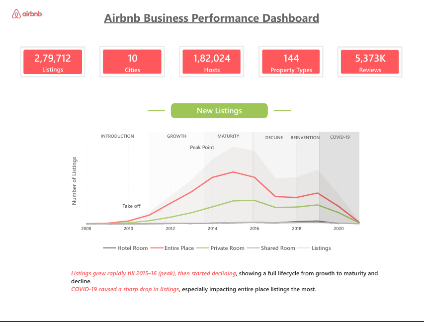
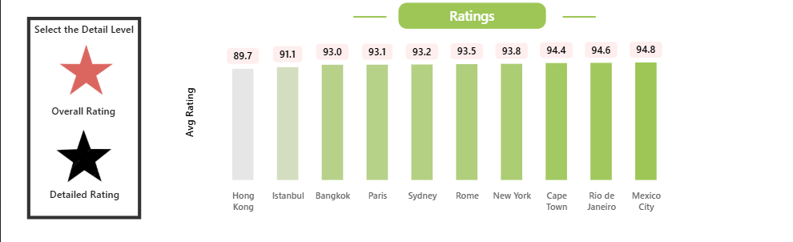
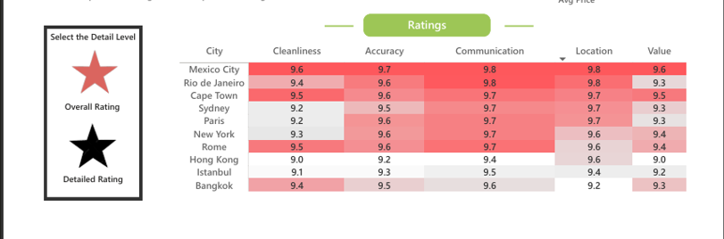

# Airbnb Analytics: Business Performance Dashboard  

An interactive Power BI dashboard to analyze Airbnb’s global performance across listings, cities, pricing, user trust, and seasonal trends.

---

## Overview  

This dashboard provides insights into Airbnb data, helping identify growth patterns, top-performing cities, pricing trends, and user behavior. It is designed to support data-driven decision-making in the short-term rental market.

---

## Key Highlights  

- Analyzed 279K+ listings, 182K+ hosts, and 5M+ reviews  
- Identified peak growth (2015–16) and decline post-COVID  
- Found market concentration in top cities like Paris, New York, and Sydney  
- Compared pricing across property types (entire place, private room, etc.)  
- Showed impact of verification and profile pictures on trust  
- Highlighted seasonal demand trends across cities  
- Included interactive ratings analysis (overall and detailed view toggle)  

---

## Tech Stack  

- Power BI Desktop  
- Power Query  
- DAX  
- Data Modeling  

---

## Data Source  

Maven Analytics Airbnb Dataset  
Includes data on listings, hosts, reviews, pricing, and cities.

---

## Dashboard Preview  

### Overview  
  
Shows overall KPIs and listing growth trends over time.

### Ratings – Overall View  
  
Displays city-wise average ratings for quick comparison.

### Ratings – Detailed View  
  
Breakdown of ratings across cleanliness, accuracy, communication, location, and value.

---

## Project Files  

- [View Dashboard (PDF)](./dashboard.pdf)  
- [DAX Measures](./dax-measures.xlsx)  
- [Power BI Template](./Business-Performance-Dashboard.pbit)  
